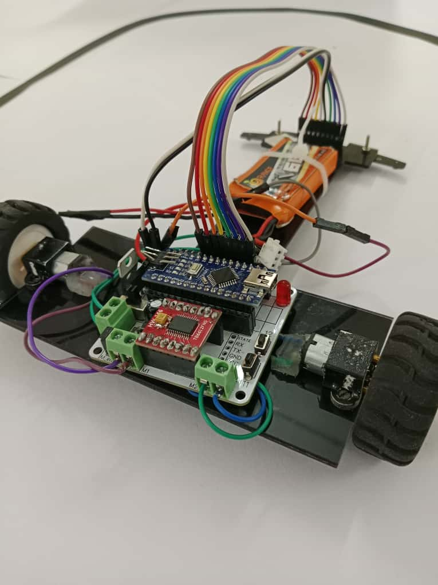
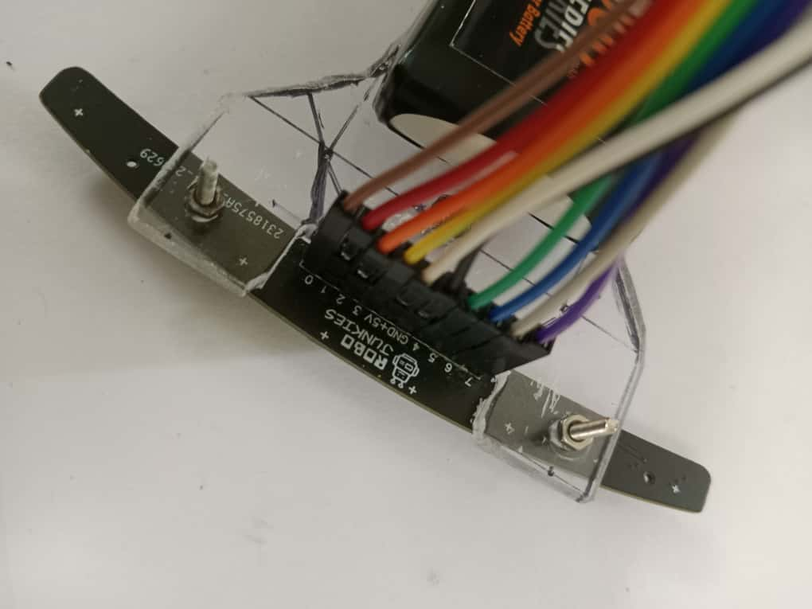

# 🚗 Line Follower Robot 

An autonomous **Line Following Robot** built using **Arduino Nano, 8-array IR sensor, and motor driver circuits**.  
The robot detects and follows a black line path using sensor-based control logic, adjusting its speed and direction in real time.

---

## 📸 Project Images

---

## ⚡ Features
- Autonomous line tracking on curved and straight paths
- **8-array IR sensor** for accurate line detection
- **Arduino Nano** as microcontroller
- Real-time motor speed and steering control
- Lightweight and modular hardware design

---

## 🛠️ Tech Stack / Components
- **Arduino Nano**
- **8-array IR Sensor**
- **L298N Dual H-Bridge Motor Driver**
- DC Motors & Wheels
- Power Supply (Li-ion battery pack)
- Chassis & Mechanical assembly

---
## 🚀 How It Works
1. The **8 IR sensors** detect the black line against a white surface.
2. Sensor readings are fed to **Arduino Nano**, which processes the path logic.
3. Control signals are sent to the **motor driver**, adjusting motor speeds.
4. Robot follows the path autonomously with optimized speed and turns.
